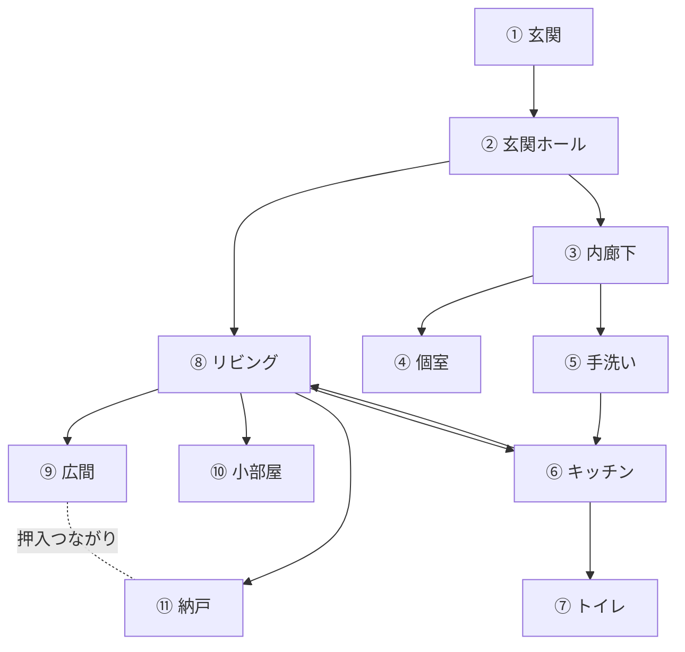

# 1階平面図ラフ（現地説明版）

作成日: 2026-06-01（初版）／**2026-06-01 間取り確定更新**  
情報源: 2026-05-23 現地写真 ＋ **現地歩き方による説明（確定）**  
前提: **民泊の貸出範囲は本館1階のみ**。離れ（2階建て）は使用しない。風呂は**本館から約1m・敷地内の別棟**（1F=浴室、2F=屋根・物干し）。

> **寸法:** 畳・建具ベースの概算（±10〜20%）。届出・消防の最終図面は要現地確認・清書。  
> **方位:** 図中の「庭側」は縁側・ガラス戸の向き。正式な方位は未確認。

---

## 一周の歩き方（確定）

玄関からぐるりと一周できる動線：

```text
① 玄関（靴箱）
  → ② 玄関ホール（畳一条）
    → 【奥】③ 内廊下
         ├ 正面の扉 → ④ 畳の個室
         ├ 隣 → ⑤ 手洗い場
         └ 手洗いの右・扉 → ⑥ キッチン
              ├ 奥 → ⑦ トイレ（細い廊下→扉→便所）
              └ 扉 → ⑧ リビング
    → 【手前】⑧ リビング（玄関ホールからも直接进入可）
         ├ 先（奥）→ ⑨ 広間（仏具）
         ├ 隣 → ⑩ 小部屋
         ├ 右奥 → ⑪ 納戸（スタッフ・備品予定）
         │         ※ ⑪納戸の押入れ ⇔ ⑨広間の押入れ（つながり）
         └ 中央の引き戸 → ⑥ キッチン（行き来）
```

---

## 全体配置図

```text
                          【庭・縁側・外】

      ┌────────────┬─────────────────────┬────────── 縁側 → 外
      │  ⑩ 小部屋  │    ⑨ 広間          │
      │  (6畳?)    │    仏間・AC        │
      │  →庭GL     │    押入 ═══ 押入 ─┼── ⑪ 納戸
      └─────┬──────┴──────────┬────────┘   (スタッフ)
            │ 障子              │ 大開口
            │                   │
      ┌─────┴───────────────────┴──────────────────────┐
      │              ⑧ リビング（6畳・TV）                │
      │                    ║ 中央引き戸 ║                │
      └───────┬────────────────────────┬─────────────────┘
              │                        │
      ┌───────┴────────┐      ┌────────┴────────────────────┐
      │ ② 玄関ホール    │      │  ⑥ キッチン                  │
      │  畳一条・下駄箱  │←─扉─│  流し・ガス・冷蔵庫          │
      └───┬────────────┘      └───┬────────────┬────────────┘
          │                       │            │
     ① 玄関                  ③ 内廊下      細廊下→ ⑦ トイレ
     (靴箱)                       │
                            ⑤ 手洗い
                            ④ 個室(扉先)
                                 → 庭GL

      【敷地内 約1m】  ┌─────────┐
                      │ 風呂棟   │ 1F=浴室 / 2F=物干し
                      └─────────┘
                      ※ 出入口・方位は要確認
```

---

## 部屋一覧

| No. | 名称 | 床 | 概算寸法 | 面積(㎡) | 主な設備・用途 |
|-----|------|-----|---------|---------|---------------|
| ① | 玄関 | 土間/木 | — | — | 靴箱・靴置き |
| ② | 玄関ホール | 畳一条+木 | 1.8×2.5 | 約4.5 | 下駄箱、内窓 |
| ③ | 内廊下 | パーケット | 1.2×2.5 | 約3.0 | **消火器** |
| ④ | 畳の個室 | 畳6畳 | 2.7×3.6 | 約9.7 | ガラス戸→庭、小コンロ |
| ⑤ | 手洗い場 | — | 約1×1 | 約1 | 洗面台（内廊下の右） |
| ⑥ | キッチン | 木フロア | 3.5×4.0 | 約14 | 流し、ガス、冷蔵庫、給湯器 |
| ⑦ | トイレ | タイル | 約1.5×1.5 | 約2 | 温水洗浄便座（キッチン奥・細廊下先） |
| ⑧ | リビング | 畳6畳 | 2.7×3.6 | 約9.7 | TV、低テーブル、**ハブ** |
| ⑨ | 広間 | 畳6〜8畳 | 2.7×3.6+ | 約10〜13 | **仏壇・位牌**、AC、縁側→外 |
| ⑩ | 小部屋 | 畳6畳 | 2.7×3.6 | 約9.7 | 布団・家具、ガラス戸→庭 |
| ⑪ | 納戸 | 畳6畳 | 2.7×3.6 | 約9.7 | **スタッフ・備品**（宿泊者外予定） |
| 別 | 風呂棟1F | — | 要確認 | 要確認 | 浴室（別建物） |

**畳部屋（④⑧⑨⑩⑪）:** 5室 × 約10㎡ ≒ **50㎡**（概算）  
**洋室・水回り（②③⑤⑥⑦＋廊下）:** 約 **25〜30㎡**（概算）  
**1階延べ（概算）:** 約 **75〜85㎡** ※登記・現地要確認

---

## 接続関係（確定）



---

## 水回り・設備

| 設備 | 位置 | 備考 |
|------|------|------|
| 手洗い | ⑤ 内廊下の隣 | |
| 台所 | ⑥ キッチン | 流し・2〜3口ガス・冷蔵庫 |
| トイレ | ⑦ キッチン奥 | 細廊下経由 |
| 浴室 | **別棟**（約1m） | 写真・動線要確認 |
| 消火器 | ③ 内廊下 | 個室扉の横 |
| エアコン | ⑨ 広間 | |
| 火災警報器 | ？ | 写真未確認 |
| 誘導灯 | ？ | 写真未確認 |

---

## 宿泊者エリア vs スタッフ（仮）

| 区分 | 部屋 | 備考 |
|------|------|------|
| **宿泊・共有候補** | ⑧リビング、⑨広間※、⑩小部屋、④個室 | ※⑨は父確認（仏間） |
| **宿泊者外（予定）** | ⑪納戸 | スタッフ・備品置場 |
| **生活動線** | ⑥キッチン、⑤手洗い、⑦トイレ、別棟風呂 | |
| **民泊外** | 離れ2階建て、風呂棟2F | |

**想定最大人数（仮）:** 4〜6名。消防署相談で確定。

---

## 避難経路（仮）

| 経路 | 内容 |
|------|------|
| A | ⑨⑩④ → ガラス戸／縁側 → 庭 → 外 |
| B | ⑧ → ② → ①玄関 → 外 |
| C | ⑥⑦側 → ③ → ② → ① |
| 風呂 | 庭経由・約1m（夜間・雨天は要検討） |

---

## 5/23 成果棚卸し（更新）

| 項目 | 状態 |
|------|------|
| 1階写真 | ○ |
| 間取り（接続） | **○ 現地説明で確定** |
| 寸法 | △ 概算のみ |
| 宿泊室・使用範囲 | △ 仮（父確認・納戸確定） |
| トイレ位置 | **○** |
| 風呂棟 | △ 存在のみ・動線未 |
| 消火器 | ○ |
| 火災警報器・誘導灯 | ？ |
| Googleマップ URL | × |
| 父との話 | × |

---

## 確認したいこと（不明点）

以下が分かると、図面・消防相談資料を仕上げられます。

1. **方位** — 玄関は道路のどちら側か。庭・縁側は南／北どちらか。
2. **畳数** — ④個室、⑧リビング、⑨広間、⑩小部屋、⑪納戸はそれぞれ何畳か（ざっくりで可）。
3. **風呂棟への出入口** — 庭から入るか。どの部屋のガラス戸・縁側が一番近いか（④⑩⑨のいずれか？）。
4. **キッチン奥の扉** — トイレ以外に行き先はあるか（以前の写真に奥の扉あり）。
5. **⑨広間** — 民泊で宿泊者が使ってよいか、仏間は立入不可か（父の意向）。
6. **一周の「戻り」** — ⑪納戸から玄関に戻るとき、⑧リビング経由で合っているか。
7. **⑩小部屋と④個室** — リビング側の「隣」と、玄関奥の個室は別室で合っているか（写真上は別に見えるが確認）。

---

## 旧版との差分（参考）

| 旧ラフ（誤） | 確定版 |
|-------------|--------|
| 和室6室を横並び想定 | **5畳室**＋玄関・水回り |
| 台所前と台所を2室 | **キッチン1室** |
| 和室ゾーンと洋室が離れすぎ | **リビングがハブ**でキッチン・玄関・和室を接続 |
| トイレ不明 | キッチン右→細廊下→トイレ |
| 納戸・広間の押入 | **つながり**を反映 |

---

## 図面の使い方

- **6月 消防署・長崎県 事前相談:** 本ラフ可（「間取りは現地確認済み・寸法概算」）。
- **届出・消防法令適合通知書:** 設計士清書 or 再採寸後に更新。
